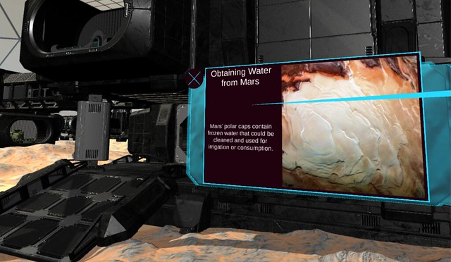

# terraforming-mars-vr
Terraforming Mars is a research-driven, annotated experience of the red planet, built in VR by Innovation Scholars and staff at the Ahmanson Lab. Players can explore what life would be like during an initial settlement (dated at 2100) and at a more advanced settlement (dated at 2300). Built using a VR plugin of [stepwise](https://github.com/eloyer/stepwise) and Unity for the Oculus Rift.

Players can interact with different objects in these scenes to see small powerpoint-like presentations on different aspects of human life on Mars.

Stepwise's VR plugin automagically turns Google Sheets into presentations in VR, allowing students to build the presentations concurrently during Unity development.

#### Screenshots

